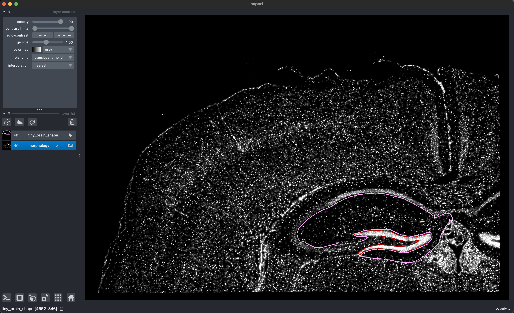

```{r global-options, include=FALSE}
knitr::opts_chunk$set(
  message = FALSE,
  warning = FALSE,
  collapse = TRUE,
  comment = "#>"
)
library(BiocStyle)
```

# MoleculeExperiment

The R package MoleculeExperiment contains functions to create and work with
objects from the new MoleculeExperiment class. We introduce this class for
analysing molecule-based spatial transcriptomics data (e.g., Xenium by 10X,
CosMx SMI by Nanostring, and Merscope by Vizgen, among others).

## Why the MoleculeExperiment class?

The goal of the MoleculeExperiment class is to:
1. Enable analysis of spatial transcriptomics (ST) data at the molecule level, 
independent of aggregating to the cell or tissue level.
2. Standardise molecule-based ST data across vendors, to hopefully facilitate
comparison of different data sources and common analytical and visualisation 
workflows.
3. Enable aggregation to a `SpatialExperiment` object given combinations of 
molecules and segmentation boundaries.

## Installation

The latest release of MoleculeExperiment can be installed using:

```{r, eval=FALSE}
if (!require("BiocManager", quietly = TRUE)) {
  install.packages("BiocManager")
}
BiocManager::install("MoleculeExperiment")
```

# Minimal example

1. Load required libraries.

```{r}
library(MoleculeExperiment)
library(ggplot2)
```

2. Create MoleculeExperiment object with example Xenium data, taken over a 
small patch.

```{r}
repoDir <- system.file("extdata", package = "MoleculeExperiment")
repoDir <- paste0(repoDir, "/xenium_V1_FF_Mouse_Brain")

me <- readXenium(repoDir, keepCols = "essential")
me
```

3. Use standardised data in ME object for molecule-level analyses. For example,
plot a simple digital in-situ, with cell boundaries overlaid.

```{r}
ggplot_me() +
  geom_polygon_me(me, assayName = "cell", fill = "grey") +
  geom_point_me(me) +
  # zoom in to selected patch area
  coord_cartesian(
    xlim = c(4900, 4919.98),
    ylim = c(6400.02, 6420)
  )
```

4. Finally, it is also possible to go from a MoleculeExperiment object to a
SpatialExperiment object. This enables the transition from a molecule-level
analysis to a cell-level analysis with already existing tools.

```{r}
# transform ME to SPE object
spe <- countMolecules(me)
spe
```

# The ME object in detail

## Constructing an ME object

### Use case 1: from dataframes to ME object 

Here we demonstrate how to work with an ME object from toy data, representing a 
scenario where both the detected transcripts information and the boundary 
information have already been read into R. This requires the standardisation
of the data with the dataframeToMEList() function.

The flexibility of the arguments in dataframeToMEList() enable the creation of
a standard ME object across dataframes comming from different vendors of
molecule-based spatial transcriptomics technologies. 

1) Generate a toy transcripts data.frame.

```{r}
moleculesDf <- data.frame(
  sample_id = rep(c("sample1", "sample2"), times = c(30, 20)),
  features = rep(c("gene1", "gene2"), times = c(20, 30)),
  x_coords = runif(50),
  y_coords = runif(50)
)
head(moleculesDf)
```

2) Generate a toy boundaries data.frame.

```{r}
boundariesDf <- data.frame(
  sample_id = rep(c("sample1", "sample2"), times = c(16, 6)),
  cell_id = rep(
    c(
      "cell1", "cell2", "cell3", "cell4",
      "cell1", "cell2"
    ),
    times = c(4, 4, 4, 4, 3, 3)
  ),
  vertex_x = c(
    0, 0.5, 0.5, 0,
    0.5, 1, 1, 0.5,
    0, 0.5, 0.5, 0,
    0.5, 1, 1, 0.5,
    0, 1, 0, 0, 1, 1
  ),
  vertex_y = c(
    0, 0, 0.5, 0.5,
    0, 0, 0.5, 0.5,
    0.5, 0.5, 1, 1,
    0.5, 0.5, 1, 1,
    0, 1, 1, 0, 0, 1
  )
)
head(boundariesDf)
```

3) Standardise transcripts dataframe to ME list format.

```{r}
moleculesMEList <- dataframeToMEList(moleculesDf,
  dfType = "molecules",
  assayName = "detected",
  sampleCol = "sample_id",
  factorCol = "features",
  xCol = "x_coords",
  yCol = "y_coords"
)
str(moleculesMEList, max.level = 3)
```

4) Standardise boundaries dataframe to ME list format.

```{r}
boundariesMEList <- dataframeToMEList(boundariesDf,
  dfType = "boundaries",
  assayName = "cell",
  sampleCol = "sample_id",
  factorCol = "cell_id",
  xCol = "vertex_x",
  yCol = "vertex_y"
)
str(boundariesMEList, 3)
```

5) Create an ME object by using the MoleculeExperiment object constructor.

```{r}
toyME <- MoleculeExperiment(
  molecules = moleculesMEList,
  boundaries = boundariesMEList
)
toyME
```

6) Add boundaries from an external segmentation algorithm.

In this example, we use the extent of the molecules of generated for `toyME` to 
allign the boundaries with the molecules. In general, the extent of the 
segmentation is required for this alignment.

```{r}
repoDir <- system.file("extdata", package = "MoleculeExperiment")
segMask <- paste0(repoDir, "/BIDcell_segmask.tif")
boundaries(toyME, "BIDcell_segmentation") <- readSegMask(
  # use the molecule extent to define the boundary extent
  extent(toyME, assayName = "detected"),
  path = segMask, assayName = "BIDcell_segmentation",
  sample_id = "sample1", background_value = 0
)

toyME
```

### Use case 2: from machine's output directory to ME object

The MoleculeExperiment package also provides functions to directly work with
the directories containing output files of commonly used technologies. This is
especially useful to work with data from multiple samples.
Here we provide convenience functions to read in data from Xenium (10X
Genomics), CosMx (Nanostring) and Merscope (Vizgen).

```{r}
repoDir <- system.file("extdata", package = "MoleculeExperiment")
repoDir <- paste0(repoDir, "/xenium_V1_FF_Mouse_Brain")

me <- readXenium(repoDir, keepCols = "essential", addBoundaries = "cell")
me
```

readXenium() standardises the transcript and boundary information such that the
column names are consistent across technologies when handling ME objects.

In addition, readXenium() enables the user to decide if they want to keep all
data that is vendor-specific (e.g., column with qv score), some columns of
interest, or only the essential columns. The latter refers to feature names and
locations of the detected transcripts, and segment ids and boundary locations of
the segmentation results.

For CosMx and Merscope data we provide convenience functions that standardise
the raw transcripts data into a MoleculeExperiment object and additionally read 
the boundaries included in the standard data releases.

```{r}
repoDir <- system.file("extdata", package = "MoleculeExperiment")
repoDir <- paste0(repoDir, "/nanostring_Lung9_Rep1")

meCosmx <- readCosmx(repoDir, keepCols = "essential", addBoundaries = "cell")
meCosmx
```

```{r}
repoDir <- system.file("extdata", package = "MoleculeExperiment")
repoDir <- paste0(repoDir, "/vizgen_HumanOvarianCancerPatient2Slice2")
meMerscope <- readMerscope(repoDir,
  keepCols = "essential",
  addBoundaries = "cell"
)
meMerscope
```

## ME object structure
A MoleculeExperiment object contains a @molecules slot and an optional 
@boundaries slot.

Both slots have a hierarchical list structure that consists of a nested list,
ultimately ending in a data.frame/tibble. Traditional rectangular data 
structures, like dataframes, redundantly store gene names and sample IDs for 
the millions of transcripts. In contrast, data in a list enables us to avoid 
this redundancy and work with objects of smaller size.

### molecules slot
The @molecules slot contains molecule-level information. The essential data it 
contains is the feature name (e.g., gene names) and x and y locations of the
detected molecules (e.g., transcripts), in each sample. Nevertheless, the user
can also decide to keep all molecule metadata (e.g., subcellular location:
nucleus/cytoplasm).

The nested list in the molecules slot has the following hierarchical structure:
"assay name" > "sample ID" > "feature name" > dataframe/tibble with X and Y
locations (and other additional columns of interest).

```{r}
showMolecules(me)
```

### boundaries slot
The @boundaries slot contains information from segmentation analyses (e.g.,
cell boundaries, or nucleus boundaries).

The nested list in the boundaries slot has the following hierarchical structure:
"assay name" > "sample ID" > "segment ID" > dataframe/tibble with the vertex
coordinates defining the boundaries for each segment. For example, if the
boundary information is for cells, the assay name can be set to "cell";
or "nucleus" if one is using nucleus boundaries.

```{r}
showBoundaries(me)
```

# Methods
Here we introduce basic methods to access and manipulate data in an ME object,
i.e., getters and setters, respectively.

## Getters
The main getters are molecules() and boundaries(). NOTE: the output of these
methods is the ME nested list, which can be very large on screen. Thus, these
getters should be used when wanting to work with the data. To quickly view the
slot contents, use showMolecules() and showBoundaries() instead.

```{r, echo=TRUE, results= 'hide'}
# NOTE: output not shown as it is too large
# access molecules slot (note: assay name needs to be specified)
molecules(me, assayName = "detected")
# access cell boundary information in boundaries slot
boundaries(me, assayName = "cell")
```

For ease of use, these getters have arguments that enable the transformation of
the data from a nested ME list format to a data.frame format.

```{r}
molecules(me, assayName = "detected", flatten = TRUE)
```

```{r}
boundaries(me, assayName = "cell", flatten = TRUE)
```

Other getters include: features() and segmentIDs().

```{r}
# get features in sample 1
features(me, assayName = "detected")[[1]]
```

```{r}
segmentIDs(me, "cell")
```

## Setters
Main setters include `molecules<-` and `boundaries<-`.
For example, with `boundaries<-` one can add new segmentation assay information
to the boundaries slot. Here we demonstrate this with the nucleus boundaries.

```{r}
repoDir <- system.file("extdata", package = "MoleculeExperiment")
repoDir <- paste0(repoDir, "/xenium_V1_FF_Mouse_Brain")
nucleiMEList <- readBoundaries(
  dataDir = repoDir,
  pattern = "nucleus_boundaries.csv",
  segmentIDCol = "cell_id",
  xCol = "vertex_x",
  yCol = "vertex_y",
  keepCols = "essential",
  boundariesAssay = "nucleus",
  scaleFactorVector = 1
)

boundaries(me, "nucleus") <- nucleiMEList
me # note the addition of the nucleus boundaries to the boundaries slot
```

The additional boundaries can be accessed, e.g. for visualisation.

```{r}
ggplot_me() +
  # add cell segments and colour by cell id
  geom_polygon_me(me, byFill = "segment_id", colour = "black", alpha = 0.1) +
  # add molecule points and colour by feature name
  geom_point_me(me, byColour = "feature_id", size = 0.1) +
  # add nuclei segments and colour the border with red
  geom_polygon_me(me, assayName = "nucleus", fill = NA, colour = "red") +
  # zoom in to selected patch area
  coord_cartesian(xlim = c(4900, 4919.98), ylim = c(6400.02, 6420))
```

# From MoleculeExperiment to SpatialExperiment
If one is interested in continuing downstream analysis at the cell-level,
the MoleculeExperiment package also provides a convenience function,
countMolecules(), that enables the transition from a MoleculeExperiment
object to a SpatialExperiment object. With this functionality, it is possible to
use already existing methods for cell-level data analysis.

```{r}
spe <- countMolecules(me, boundariesAssay = "nucleus")
spe
```

# Case Study: MoleculeExperiment and napari

Load the demonstration data, which includes molecules for 2 genes.

```{r}
data(small_me)
```

Read in virtual dissection CSV file, exported from napari (screenshot), of the morphology image.



```{r}
bds_colours <- setNames(
  c("#aa0000ff", "#ffaaffff"),
  c("Region 1", "Region 2")
)

file_path <- system.file("extdata/tiny_brain_shape2.csv", package = "MoleculeExperiment")

bds_shape_raw <- read.csv(file = file_path, header = TRUE)
bds_shape_raw$sample_id <- "xenium_tiny_subset"
bds_shape_raw$regionName <- names(bds_colours)[bds_shape_raw$index + 1]

bds_shape <- dataframeToMEList(bds_shape_raw,
  dfType = "boundaries",
  assayName = "virtualDissection",
  sampleCol = "sample_id",
  factorCol = "regionName",
  xCol = "axis.1",
  yCol = "axis.0",
  scaleFactor = 0.2125
)

boundaries(small_me, "virtualDissection") <- bds_shape
```

We can plot the resulting MoleculeExperiment using the following code.

```{r}
g <- ggplot() +
  geom_point_me(
    small_me,
    assayName = "detected", byColour = "feature_id", size = 0.2
  ) +
  geom_polygon_me(
    small_me,
    assayName = "cell", fill = NA, colour = "grey50", size = 0.1
  ) +
  geom_polygon_me(
    small_me,
    assayName = "nucleus", fill = NA, colour = "black", size = 0.1
  ) +
  geom_polygon_me(
    small_me,
    assayName = "virtualDissection", byFill = "segment_id", alpha = 0.3
  ) +
  scale_y_reverse() +
  theme_classic() +
  theme(axis.text = element_blank()) +
  theme(axis.ticks = element_blank()) +
  coord_fixed() +
  scale_fill_manual(values = bds_colours) +
  NULL
g
```

Now that we have added the virtual dissection boundaries, we can use countMolecules to generate psuedobulk expressions over these regions.

```{r, eval=FALSE}
spe <- countMolecules(
  small_me, boundariesAssay = "virtualDissection")
spe
```


# SessionInfo

```{r}
sessionInfo()
```
